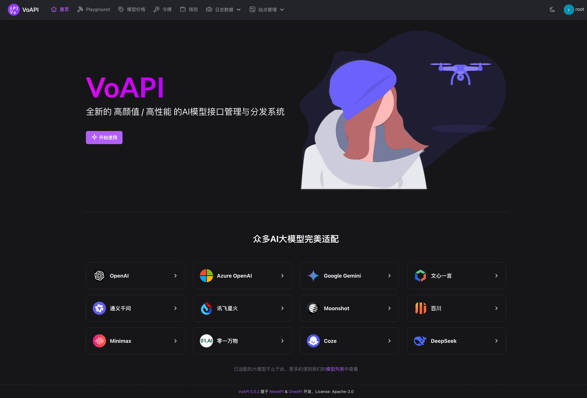
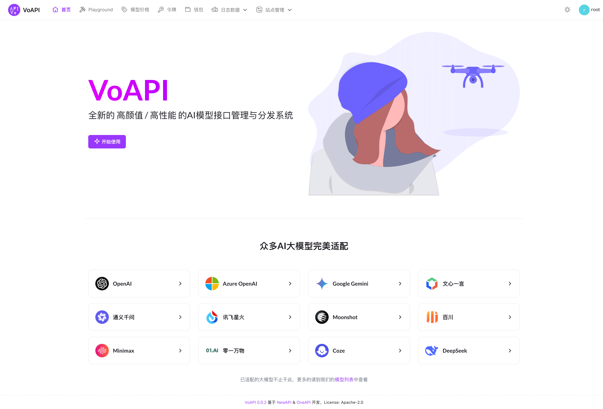
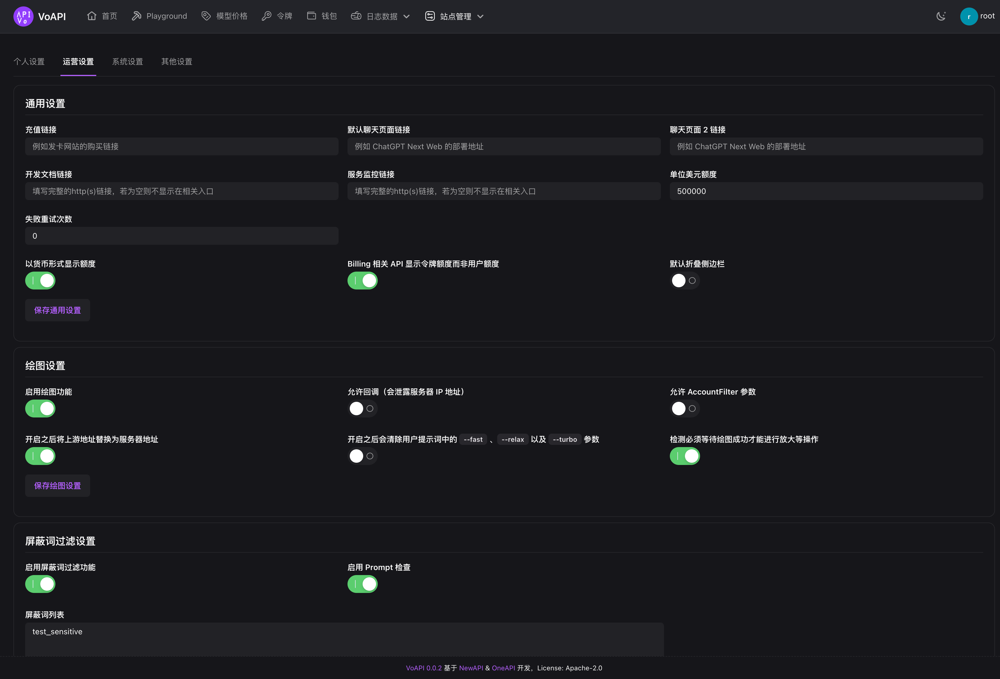
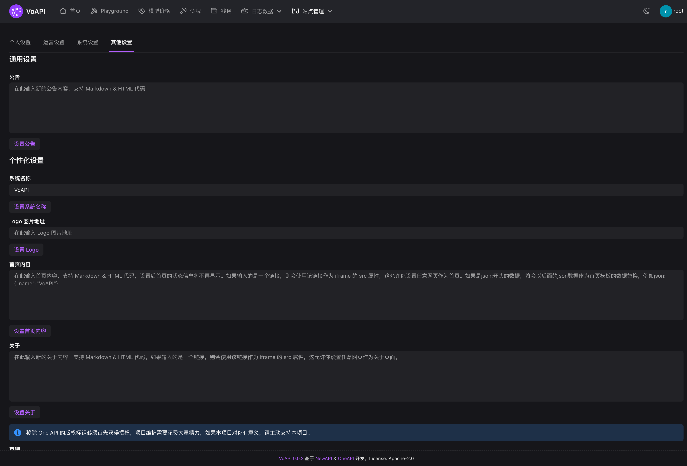
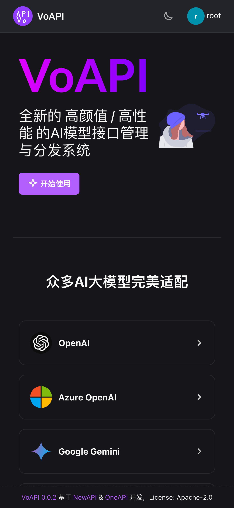

## 介绍
全新的高颜值/高性能的AI模型接口管理与分发系统

> [!NOTE]
> 本项目在[NewAPI](https://github.com/Calcium-Ion/new-api) & [OneAPI](https://github.com/songquanpeng/one-api)的基础上进行二次开发

> [!IMPORTANT]
> 使用者必须在遵循 OpenAI 的[使用条款](https://openai.com/policies/terms-of-use)以及**法律法规**的情况下使用，不得用于非法用途。
> 本项目仅供个人学习使用，不保证稳定性，且不提供任何技术支持。
> 根据[《生成式人工智能服务管理暂行办法》](http://www.cac.gov.cn/2023-07/13/c_1690898327029107.htm)的要求，请勿对中国地区公众提供一切未经备案的生成式人工智能服务。

> [!TIP]
> 最新版Docker镜像：`licoy/voapi:latest`  
> 默认账号`root`
> 密码`123456`
> 更新指令：
> ```
> docker run --rm -v /var/run/docker.sock:/var/run/docker.sock containrrr/watchtower -cR
> ```

> [!WARNING]
> 本系统为闭源免授权使用，仅供个人或者组织团队内部管理与分发渠道使用，请勿用于任何商业用途。

## 差异说明
> 本系统与NewAPI的差异主要在于：

- [x] 整体界面风格的差异
- [x] 增加开发文档独立页支持
- [x] 增加服务监控页配置支持
- [x] 增加LinuxDO的第三方登录支持
- [x] 优化部分界面元素的边距避免挤在一起
- [x] 优化第三方登录部分逻辑
- [ ] 用户注册时间支持
- [ ] 增加令牌分组支持
- [ ] 增加Flux API的支持
- [ ] 增加StabilityAI API的支持
- [ ] 增加可灵API的支持
- [ ] 增加易支付自定义渠道支持
- [ ] 增加对话模型请求字段过滤支持

## 使用说明

在您的服务器新建`docker-compose.yml`文件，内容如下：
```
version: '3.4'

services:
  voapi:
    image: licoy/voapi:latest
    container_name: voapi
    restart: always
    command: --log-dir /app/logs
    ports:
      - "3000:3000"
    volumes:
      - ./data:/data
      - ./logs:/app/logs
    environment:
      - SQL_DSN=root:123456@tcp(host.docker.internal:3306)/voapi  # 修改此行，或注释掉以使用 SQLite 作为数据库
      - REDIS_CONN_STRING=redis://redis
      - SESSION_SECRET=random_string  # 启动前必须手动修改此值为随机字符串
      - TZ=Asia/Shanghai

    depends_on:
      - redis
    healthcheck:
      test: [ "CMD-SHELL", "wget -q -O - http://localhost:3000/api/status | grep -o '\"success\":\\s*true' | awk -F: '{print $2}'" ]
      interval: 30s
      timeout: 10s
      retries: 3

  redis:
    image: redis:latest
    container_name: redis
    restart: always

```
启动服务：
```
docker-compose up -d
```
访问`http://ip:3000`即可看到登录界面，输入默认账号密码即可登录。

## 加群交流
> 您也可以扫描下方二维码加入QQ交流群以获取最新的开发动态和相关事件
> 
> 点击链接加入群聊：https://qm.qq.com/q/QFibUxMPEQ


## 界面截图
### PC端
- 首页

- 首页（亮色模式）

- 配置页面

- 配置页面

### 移动端
- 首页


